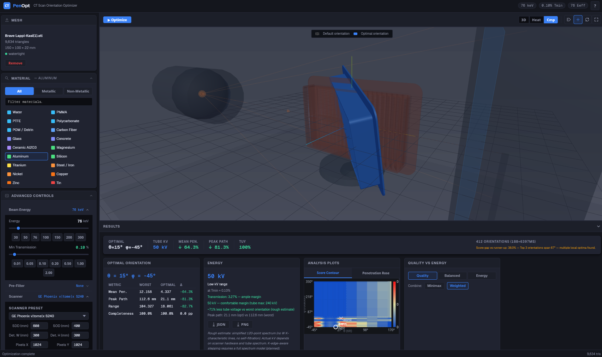

# PenOpt - CT Scan Orientation Optimizer

> **Find the optimal orientation for industrial X-ray CT scanning.** Load a 3D mesh (STL/OBJ), configure beam energy and scanner geometry, and search over tilt/rotation angles to minimize penetration path length, energy requirements, and cone-beam artifacts.



[](https://github.com/donrami/PenOpt/releases/tag/v0.2.0)
[](LICENSE)
[](https://go.dev/dl/)

---

## Table of Contents

- [Download & Install](#download--install)
- [Quick Start](#quick-start)
- [What This Does](#what-this-does)
- [Features](#features)
- [Worked Example](#worked-example)
- [Usage](#usage)
- [Objective Functions](#objective-functions)
- [How It Works](#how-it-works)
- [Validation](#validation)
- [Limitations](#limitations)
- [Performance](#performance)
- [Citation](#citation)
- [Keyboard Shortcuts](#keyboard-shortcuts)
- [References](#references)
- [Roadmap](#roadmap)
- [Project Structure](#project-structure)
- [Contributing](#contributing)
- [Acknowledgments](#acknowledgments)
- [License](#license)

---

## Download & Install

### Prebuilt Binaries

Prebuilt binaries for **Windows**, **macOS** (Intel + Apple Silicon), and **Linux** are built automatically by CI when a new tag is pushed. See the [Releases page](https://github.com/donrami/PenOpt/releases) for the latest downloads.

### Build from Source

```bash
# Install dependencies
cd frontend && npm install && cd ..

# Run with live hot-reload
wails dev

# Build a production binary
wails build
```

Open http://localhost:34115 after `wails dev` starts.

### Requirements

- [Go](https://go.dev/dl/) 1.23+
- [Node.js](https://nodejs.org/) 18+
- [Wails v2](https://wails.io/docs/gettingstarted/installation) CLI

On Linux, install Wails system dependencies (`libgtk-3-dev`, `libwebkit2gtk-4.0-dev`) per the [Linux setup guide](https://wails.io/docs/gettingstarted/installation#platform-specific-dependencies).

---

## Quick Start

1. **Load a mesh** - drag-and-drop an STL or OBJ file onto the drop zone.
2. **Select a material** - pick from the NIST XCOM database (40+ materials, category tabs, search).
3. **Set beam energy** - enter kV and optional pre-filter (Cu, Al, Sn, Ti).
4. **Configure scanner** - choose a preset (Nikon, GE, Zeiss, …) or set SDD, SOD, detector manually.
5. **Choose a weight preset** - Quality, Balanced, or Energy.
6. **Click Optimize** - review the optimal orientation (θ, φ), kV recommendation, and IntelliScan projection schedule.

---

## What This Does

Given a 3D mesh of a manufactured part, PenOpt casts simulated X-rays through the geometry at hundreds of orientations and picks the one that minimizes penetration, energy requirements, and cone-beam artifacts. It returns the optimal tilt (θ) and rotation (φ) angles, recommends a tube voltage (kV), and generates IntelliScan projection schedules.

Built with [Wails v2](https://wails.io/) - Go backend with BVH-accelerated ray casting, Three.js/WebGL frontend.

---

## Features

### At a Glance

| Capability | Details |
|---|---|
| **Ray casting** | BVH-accelerated (median-split BVH, Möller-Trumbore), parallel goroutines |
| **Search** | Coarse-to-fine grid: 15° to 1° refinement, global normalization |
| **Objectives** | f_mtl (generalized-mean penetration), f_energy (max path), f_hdn (projection range) |
| **Scoring** | Minimax or weighted combination, 3 weight presets |
| **Tuy-Smith tracking** | Completeness fraction per orientation, warning < 90 % |
| **Materials** | 40+ NIST XCOM entries with energy-dependent μ/ρ, log-log interpolation |
| **Beam filters** | Cu, Al, Sn, Ti presets with polyenergetic effective energy (120-point spectrum) |
| **Scanner presets** | 13 industrial/medical presets (Nikon, GE, Zeiss, Siemens, Philips, dental CBCT) |
| **IntelliScan** | Tangent-ray projection selection, scan time vs. 360° |
| **3D viewport** | Three.js, smooth animated rotation, per-face heatmap, beam geometry viz |
| **Analysis plots** | Score contour (bilinear-interpolated heatmap), penetration rose (polar) |
| **Export** | JSON (full result set) and PNG (viewport + summary overlay) |
| **Ray sampling** | Adjustable grid: 4×4 (fast preview) to 32×32 (high accuracy) |
| **Search range** | ±30° to ±75° with boundary-edge warnings |

### In Depth

The NIST XCOM material database covers 40+ materials with energy-dependent attenuation coefficients. The polyenergetic effective energy calculation uses 120-point spectrum integration, and the kV recommendation shows the minimum tube voltage needed alongside the actual transmission margin (low / ample), tube feasibility check against the selected scanner's rated max kV, and the Tmin threshold that drove the recommendation.

PenOpt ships with 13 industrial and medical CT presets (Nikon, GE, Zeiss, Siemens, Philips, dental CBCT). You can also set SDD, SOD, detector dimensions and resolution manually.

Visualization includes per-face penetration heatmaps, score contour plots with search boundary overlay, and a penetration rose comparing optimal vs. worst orientations. There's also an optional 3D cone-beam diagram and a compare mode with ghost overlay to see the default orientation side-by-side with the optimal one.

The IntelliScan feature computes unique tangent-ray projection angles from rotated face normals and reports the reduction vs. a full 360° scan with a time estimate. Angles can be copied or exported as JSON.

The UI uses a dark theme with Inter and JetBrains Mono, material filter tabs with live search, a real-time progress ring with orientation HUD, keyboard shortcuts, and session persistence across restarts.

---

## AI Integration (MCP)

PenOpt ships a headless **MCP server** that lets AI assistants like Claude load meshes and run CT orientation optimization directly. Your mesh data never leaves your machine — communication is over local stdin/stdout.

```bash
# Download penopt-mcp from the latest release, then configure:
claude mcp add penopt -- /usr/local/bin/penopt-mcp
```

Then just ask:

> *"Load /home/user/part.stl and find the optimal CT scan orientation."*

**Supported clients:** Claude Desktop, Claude Code, and any MCP-compatible AI client.

[Full setup guide →](cmd/penopt-mcp/README.md)

### Available Tools

| Tool | What it does |
|---|---|
| `load_mesh` | Load STL/OBJ file, parse, center, build BVH |
| `get_mesh_info` | Return mesh metadata |
| `evaluate_orientation` | Score a single (θ, φ) orientation |
| `run_optimization` | Full coarse→fine grid search with diagnostics |

---

## Worked Example

> **Scenario:** A 50 mm Inconel 718 turbine blade, scanned at 450 kV with a 1 mm Cu pre-filter on a Nikon XTH 225. The default orientation (as-printed, upright) yields a maximum X-ray path length of ~85 mm through the thickest cross-section.

After running PenOpt with the **Balanced** weight preset and **medium ray sampling (16×16)** over a ±45° search range:

- **Optimal orientation:** θ = 12°, φ = 340°
- **Maximum path length (f_energy):** reduced to ~52 mm (≈ 40 % reduction)
- **kV recommendation:** 450 kV (High) - confirmed sufficient for the reduced path
- **IntelliScan:** 14 tangent-ray projections identified, covering 92 % of faces (Tuy-Smith completeness)
- **Scan time estimate:** ~30 % of a full 360° acquisition

Actual results depend on geometry, material, and scanner configuration. Quantitative validation against real CT data is planned (see [Validation](#validation)).

---

## Usage

### 1. Load a mesh

Drag-and-drop or click the drop zone to open the file dialog. Supports STL (binary and ASCII) and OBJ. The mesh is centered at origin and a BVH is built on load. Watertight status and boundary edge count are shown.

> **Non-watertight meshes:** Penetration values will be underestimated. A warning banner appears when open edges are detected.

### 2. Configure material

Pick a material from the NIST XCOM database using the category tabs (All / Metallic / Non-Metallic) or the search field. Set beam energy (keV) and minimum transmission (Tmin) - the effective energy after filtering is computed live.

### 3. Configure scan

Choose a scanner preset or set SDD, SOD, detector dimensions, and pixels manually. Optionally add a beam pre-filter and see effective energy shift, HVL-Cu, and flux ratio.

### 4. Set optimization parameters

- **Quality / Balanced / Energy presets** - choose how to combine objectives (minimax or weighted)
- **Ray Sampling slider** - lower values (4×4) for fast preview, higher (32×32) for accurate results
- **Search Range slider** - narrow (±30°) for focused search, wide (±75°) for comprehensive coverage

### 5. Run optimization

Click **Optimize** in the sidebar or viewport header. The search runs asynchronously - progress is shown as a ring overlay, percentage, and live orientation label (θ, φ). Stop the search at any time.

### 6. Review results

- Optimal orientation (θ, φ) with per-metric comparison to worst orientation
- kV recommendation with qualitative guidance
- Tuy completeness warning if below 90 %
- Boundary warning if optimum is near search range edge
- IntelliScan angles card with copy/export actions
- Analysis plots: score contour and penetration rose

### 7. Export

Save results as JSON for programmatic use, or as a PNG screenshot with summary overlay.

---

## Objective Functions

| Function | Description | Target |
|---|---|---|
| **f_mtl** | Generalized mean of X-ray path lengths (m=3, cube-root). Penalizes orientations with long penetration paths. | Minimize |
| **f_energy** | Maximum path length across all rays. Determines the X-ray tube voltage needed. | Minimize |
| **f_hdn** | Range of max path lengths across projections. Low values mean more isotropic ray coverage. | Minimize |
| **f_tuy** | Fraction of faces with at least one tangent ray (Tuy-Smith completeness). Warning shown below 90 %. | Track (warning) |

---

## How It Works

PenOpt searches over two angles - tilt θ (rotation around X) and rotation φ (rotation around Y) - evaluating ray casting results at each candidate orientation:

1. **Rotate** the mesh by θ and φ.
2. **Cast rays** from the X-ray source through a ray grid at N projection angles, traversing the BVH to find all intersections and measure path length through solid material.
3. **Evaluate objectives** from the path length array.
4. **Coarse phase:** 15° grid over the configured range (±45° default).
5. **Refinement phase:** top-3 coarse candidates refined at 1° in ±5° neighborhoods.
6. **Global normalization** across all coarse + fine results (avoids batch-local bias).
7. **Score:** minimax or weighted combination across objectives.
8. **IntelliScan:** tangent angles from rotated face normals.

---

## Validation

Quantitative validation against real CT scan data is planned. The following are on the roadmap:

- Comparison of PenOpt-predicted optimal orientations against orientations selected by experienced CT operators for a reference set of industrial parts
- Monte Carlo (MC) simulation cross-check of penetration path lengths for selected geometries
- Reproducibility assessment: variance of optimal orientation across ray sampling resolutions
- kV recommendation accuracy vs. real tube loading trials

Current accuracy estimates are based on synthetic ray-casting benchmarks (see [Performance](#performance)). Contributions of validation data are welcome - if you have CT scans with known ground truth, get in touch.

---

## Limitations

- **Single-material only.** PenOpt models a homogeneous part. Multi-material assemblies (e.g., embedded inserts, coatings, bimetallic structures) are not yet supported - penetration values for such parts are approximate.
- **Non-watertight meshes.** Open edges cause X-rays to pass through gaps, underestimating true path length. A warning is shown when boundary edges are detected.
- **No beam-hardening correction.** The current objective set does not include an f_bh term (planned). Polyenergetic effects are approximated via effective energy only.
- **Single-objective scalarization.** The weighted-sum / minimax approach collapses multiple objectives into a single score. Pareto-front exploration (NSGA-II) is planned for multi-objective trade-off analysis.
- **Search range boundary sensitivity.** If the optimum lies on the search range edge, a warning is shown. The result may be suboptimal outside the configured range.
- **Large meshes.** Ray-casting performance scales with triangle count. Very large assemblies ( > 1M triangles) may require mesh simplification or reduced ray sampling. An integrated simplification pass (Garland & Heckbert) is available.

---

## Performance

| Factor | Typical Value | Notes |
|---|---|---|
| **Search duration** | 30 s – 5 min | Depends on mesh size, ray sampling, and search range |
| **Ray sampling grid** | 4×4 to 32×32 | 4×4 ≈ 16 rays/projection; 32×32 ≈ 1024 rays/projection |
| **Projections evaluated** | 200 – 800 | Coarse (≈100) + refinement (≈100–700) |
| **BVH build time** | < 1 s for typical industrial parts (< 500k triangles) | Median-split, single-threaded |
| **Hardware** | CPU only, multi-core | Ray casting parallelized across goroutines; no GPU required |

Detailed benchmarks across representative geometries will be added once the validation dataset is ready.

---

## Citation

If you use PenOpt in your research, please cite:

```bibtex
@software{penopt2026,
  author = {Abu-Hamad, Rami},
  title = {PenOpt: CT Scan Orientation Optimizer},
  year = {2026},
  url = {https://github.com/donrami/PenOpt},
  doi = {10.5281/zenodo.XXXXXXX}  % DOI pending
}
```

For the underlying methodology, see the [References](#references) section.

---

## Keyboard Shortcuts

| Shortcut | Action |
|---|---|
| `Ctrl+O` | Open file dialog |
| `Ctrl+Enter` | Start optimization |
| `Esc` | Dismiss error / help overlay |
| `1` | 3D view mode |
| `2` | Heatmap view mode |
| `3` | Compare view mode |
| `R` | Reset camera |
| `F` | Toggle fullscreen |

---

## References

- **Ito, T. et al. (2020)** - "Optimization of X-ray CT scanning orientation for additive manufactured parts using ray casting." *Precision Engineering*, 64, 232–240.
- **Butzhammer, L. et al. (2026)** - Tangent-ray selection for cone-beam CT. *Internal research reference.*
- **Lifton, J. & Poon, E. (2023)** - IntelliScan adaptive projection allocation.
- **NIST XCOM** - Photon Cross Sections Database.

---

## Roadmap

- [ ] **f_bh implementation** - polyenergetic beam-hardening objective replacing the current placeholder
- [ ] **NSGA-II multi-objective optimization** - Pareto-front exploration instead of scalarized weights
- [ ] **Adaptive ray grid** - projection count dynamically allocated based on orientation variance
- [ ] **Results history** - persist and compare multiple optimization runs

---

## Project Structure

```
penopt/
├── main.go                    # Wails v2 entry point
├── app.go                     # Thin composition layer - Go packages to frontend bindings
├── wails.json                 # Wails configuration
├── frontend/                  # Three.js/WebGL single-page app (Vite 5)
│   ├── src/
│   │   ├── main.js, state.js, scene.js, ...
│   │   └── style.css          # Dark-theme design system (CSS variables)
│   └── package.json
├── internal/
│   ├── app/                   # Wails adapters: MeshLoader, Optimizer, PhysicsAPI, ScannerAPI
│   ├── bvh/                   # Bounding volume hierarchy (median-split, Möller-Trumbore)
│   ├── mesh/                  # Mesh type, STL/OBJ parsers, watertight validation
│   ├── objectives/            # f_mtl, f_energy, f_hdn, normalization, CombinedScore
│   ├── physics/               # NIST XCOM database, Beer-Lambert, filter effects
│   ├── raycaster/             # BVH ray casting, ray grid, transmission lengths, heatmap
│   ├── search/                # Coarse-to-fine grid, IntelliScan, Tuy-Smith completeness
│   └── vec/                   # 3D vector math
└── build/                     # Icons, installer config
```

---

## Contributing

Contributions are welcome. Please open an issue to discuss changes before submitting PRs.

---

## Acknowledgments

- **Möller-Trumbore algorithm** (Möller & Trumbore 1997) for ray-triangle intersection (https://doi.org/10.1080/10867651.1997.10487468)
- **NIST XCOM** (Berger et al., NISTIR 6537) photon cross-section material database (https://dx.doi.org/10.18434/T48G6X)
- **Garland & Heckbert 1997** Surface Simplification Using Quadric Error Metrics, used by fogleman/simplify (https://mgarland.org/files/papers/quadrics.pdf)
- **fogleman/simplify** Go implementation of quadric error metric mesh simplification (https://github.com/fogleman/simplify)
- **Ito et al. (2020)** orientation optimization framework using ray casting (https://doi.org/10.58286/25108)
- **Heinzl et al. (2011)** ray casting methodology for CT specimen placement (https://www.ndt.net/article/dir2011/papers/p6.pdf)
- **Butzhammer et al. (2026)** automated tangent-ray projection selection (https://doi.org/10.58286/32560)
- **Lifton & Poon (2023)** IntelliScan adaptive projection allocation (https://doi.org/10.3233/XST-221280)
- **Tucker et al. (1991)** tungsten anode X-ray spectrum model (https://doi.org/10.1118/1.596709)
- **Boone & Seibert (1997)** accurate tungsten spectrum generation (https://doi.org/10.1118/1.597953)
- **Deb et al. (2002)** NSGA-II multiobjective optimization, planned (https://doi.org/10.1109/4235.996017)
- **Wails v2** Go + web frontend desktop application framework (https://github.com/wailsapp/wails)
- **Three.js** r170 JavaScript 3D library for viewport rendering (https://github.com/mrdoob/three.js/)

---

## License

MIT © [Rami Abu-Hamad](mailto:rami@abu-hamad.de)
